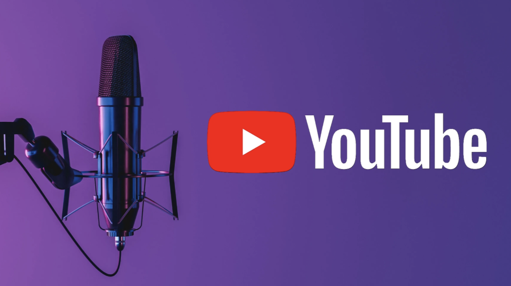
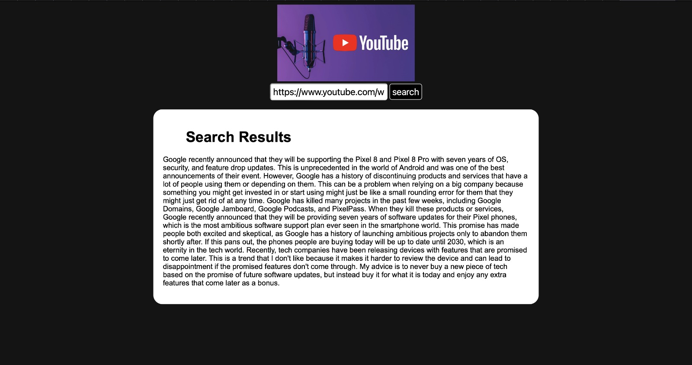

# YouTube Transcriber and Summarizer

## Overview

The YouTube Transcriber and Summarizer is a Python application that leverages OpenAI's API to transcribe the audio from a YouTube video and generate a summary of the video's content. It provides a convenient way to extract valuable information from videos quickly.

## Features

- Transcribe the audio from a YouTube video.
- Summarize the transcribed content.
- Easy-to-use GUI.
- Supports various video formats and qualities.

